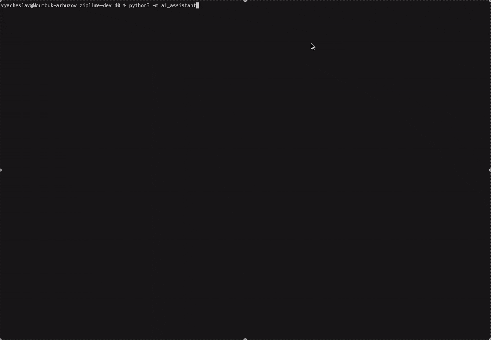

### The first open-source backtester with native AI support

**Write trading strategies in plain English. Backtest them in seconds.**

*Built on the legacy of Zipline. Rebuilt for the age of AI.*

<a target="new" href="https://pypi.python.org/pypi/ziplime"></a>
<a target="new" href="https://pypi.python.org/pypi/ziplime"></a>
<a target="new" href="https://pypi.python.org/pypi/ziplime"></a>
<a target="new" href="https://github.com/Limex-com/ziplime"></a>

[Quick Start](#-quick-start) • [AI Strategies](#-ai-powered-strategies) • [Documentation](https://limex-com.github.io/ziplime/) • [Community](#-community--support)

---

## The Problem

Zipline was the gold standard of backtesting — until it was abandoned. Pinned to legacy pandas, Python 3.6, and deprecated dependencies, it became unusable. Dozens of forks tried to patch it. None truly modernized it.

Meanwhile, AI can now write trading strategies — but every tool forces you to copy-paste between ChatGPT and your terminal, manually fixing imports, data formats, and API quirks.

There had to be a better way.

---

## The Solution

Ziplime is Zipline reborn from scratch for 2026:

- 🧠 **AI generates strategies natively** — describe what you want in plain English, Ziplime writes the code, runs the backtest, and returns the results. No copy-paste. No glue code. Everything runs locally and privately.
- ⚡ **Polars replaces pandas & NumPy** — dramatically faster data pipelines, especially on Apple Silicon.
- 🔴 **Live trading built in** — the same algorithm file works for backtesting and live execution via Lime Trader SDK. No rewrite required.
- 📊 **Any data, any frequency** — 1-minute, hourly, daily, weekly, monthly, or any custom period. OHLCV + fundamentals (P/E, revenue, margins, earnings).

> Ziplime is not a wrapper around an LLM.
> It is a full-featured, production-grade backtesting engine that also understands natural language.

---

## 🧠 AI-Powered Strategies

Describe your trading idea in plain English. Ziplime does the rest.

```
"Buy AAPL when its 20-day moving average crosses above the 50-day moving average.
 Sell when it crosses back below. Use 100% of capital."
```

The AI engine will:

1. Generate clean, production-ready algorithm code
2. Download the required historical data automatically (Yahoo Finance, free)
3. Run the backtest on your local machine
4. Return full performance metrics and a QuantStats tearsheet

Everything stays on your machine. Your strategies are yours.



```bash
# Install dependencies
pip install ziplime
pip install -r ai_assistant/requirements.txt

# Set your OpenRouter API key (free at https://openrouter.ai)
export OPENROUTER_API_KEY=your_key_here

# Launch the AI assistant
python -m ai_assistant
```

```
╔══════════════════════════════════════════════════════╗
║          Ziplime AI Backtesting Assistant            ║
║                                                      ║
║  Describe any trading strategy in plain language.    ║
║  The AI will generate and run the backtest for you.  ║
║                                                      ║
║  Data source: Yahoo Finance (free, no API key)       ║
║  Type 'help' for examples, 'quit' to exit.           ║
╚══════════════════════════════════════════════════════╝

You: RSI mean-reversion on AAPL for 2023
```

---

## ⚡ Performance That Matters

Ziplime replaces the entire pandas/NumPy data layer with [Polars](https://pola.rs/) — a lightning-fast DataFrame library written in Rust.

```
Benchmark: 5 years daily data, 500 assets, SMA crossover strategy

Ziplime (Polars)  ████████░░░░░░░░░░░░░░░░░░  12.4s
Zipline (pandas)  █████████████████████████░  38.7s
Backtrader        ████████████████████████████ 52.1s
```

*Tested on Apple Silicon M3, Python 3.12*

---

## 🚀 Quick Start

```bash
pip install ziplime
```

**Traditional way — write your strategy in Python:**

```python
# my_strategy.py
from ziplime.finance.execution import MarketOrder

async def initialize(context):
    context.asset = await context.symbol("AAPL")
    context.invested = False

async def handle_data(context, data):
    if not context.invested:
        await context.order_target_percent(
            asset=context.asset, target=1.0, style=MarketOrder()
        )
        context.invested = True
```

```python
import asyncio
import datetime
from ziplime.core.run_simulation import run_simulation

asyncio.run(run_simulation(
    algorithm_file="my_strategy.py",
    start_date=datetime.datetime(2023, 1, 1, tzinfo=datetime.timezone.utc),
    end_date=datetime.datetime(2023, 12, 31, tzinfo=datetime.timezone.utc),
    total_cash=100_000,
    trading_calendar="NYSE",
))
```

**AI way — describe your strategy in English:**

```bash
pip install -r ai_assistant/requirements.txt
export OPENROUTER_API_KEY=your_key_here
python -m ai_assistant
```

---

## 📡 Multiple Data Sources

| Source | Type | Cost |
|---|---|---|
| Yahoo Finance | Historical OHLCV | Free |
| CSV files | Any custom data | Free |
| Lime Trader SDK | Real-time & historical | Broker account |
| LimexHub | Professional-grade data + fundamentals | Subscription |

---

## 🔴 From Backtest to Live in Zero Lines

The same algorithm file. The same logic. Just change the execution mode.

```bash
# Backtest
python -m ziplime run -f my_strategy.py --start-date 2023-01-01 --end-date 2023-12-31

# Live trade (via Lime Trader SDK)
python -m ziplime run -f my_strategy.py --mode live
```

No adapter classes. No rewriting logic. No "paper trading wrapper."
Your backtest IS your live strategy.

---

## Comparison with original Zipline

| Feature | Zipline | **Ziplime** |
|---|---|---|
| Data engine | NumPy / HDF5 | **Polars / Parquet** |
| Performance | Baseline | **2–5× faster** |
| Data frequencies | Daily only | **Any frequency** |
| Fundamental data | — | **Yes** |
| Async support | — | **Full asyncio** |
| Live trading | — | **Lime Trader SDK** |
| Multiple data sources | Limited | **LimexHub, Yahoo Finance, CSV, SDK** |
| **AI strategy generation** | — | **✅ Native** |
| Python requirement | 3.6 | **3.12+** |
| Maintained | ❌ Abandoned | **✅ Active** |

---

## 🤝 Community & Support

- 📖 [Documentation](https://limex-com.github.io/ziplime/)
- 🐛 [Issues](https://github.com/Limex-com/ziplime/issues)
- 🏠 [Limex](https://limex.com)

---

*Zipline is dead. Long live Ziplime.* 🍋

**⭐ Star this repo if you believe backtesting should be fast, intelligent, and free.**
